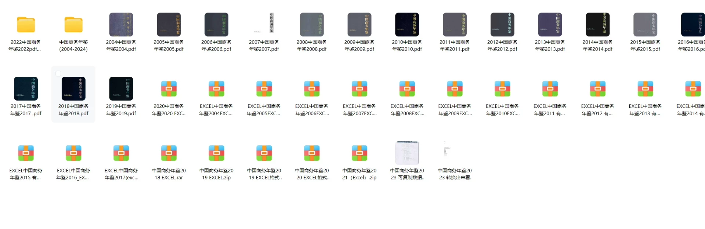
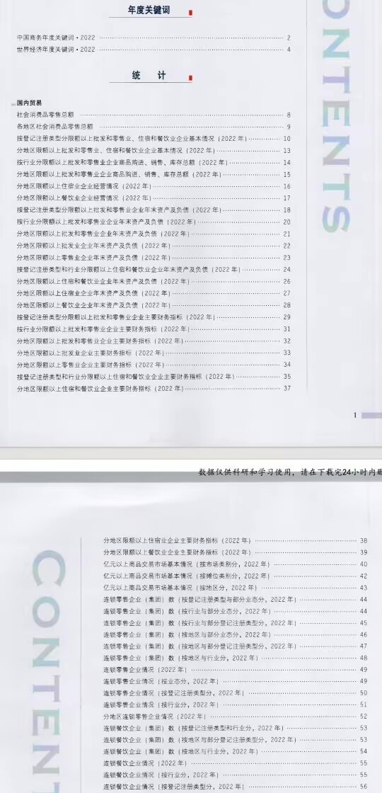
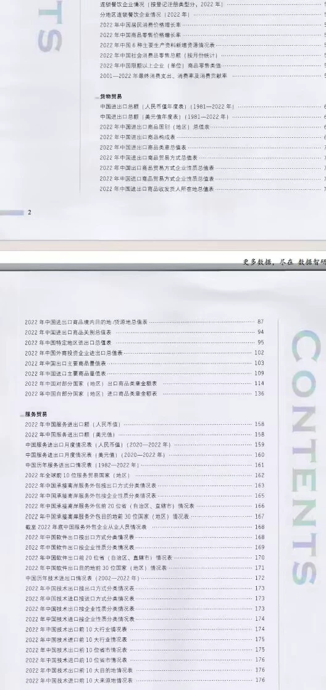
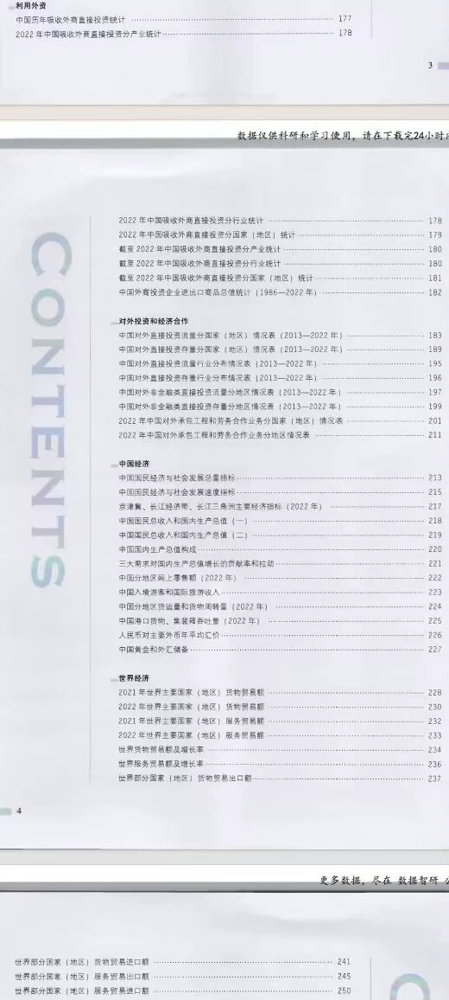
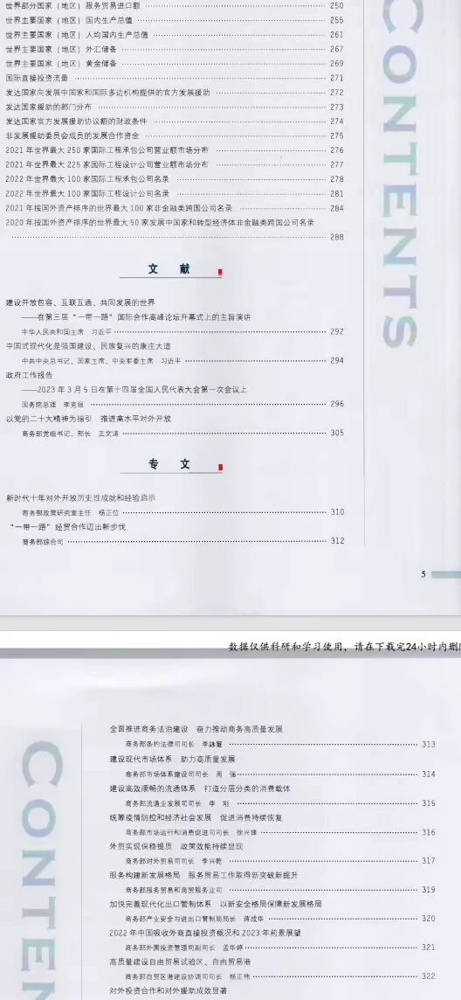
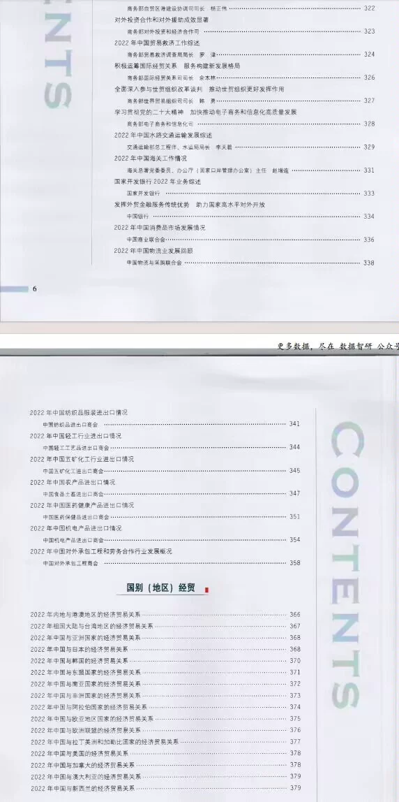
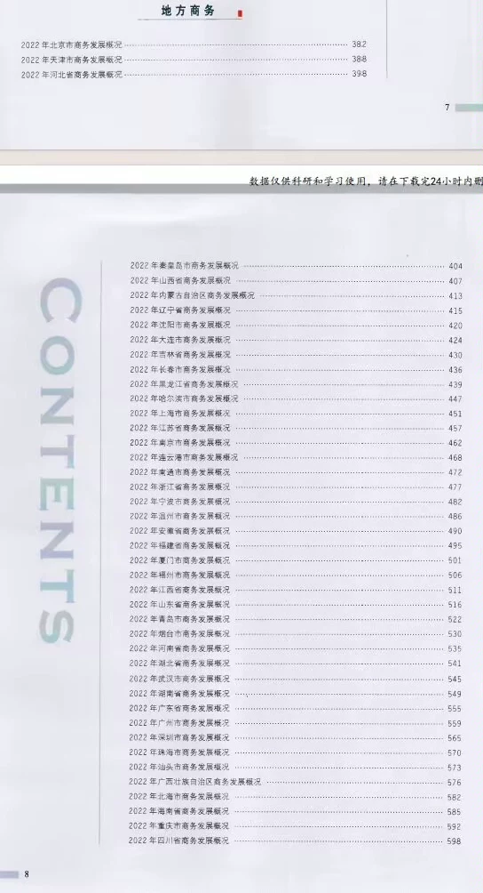
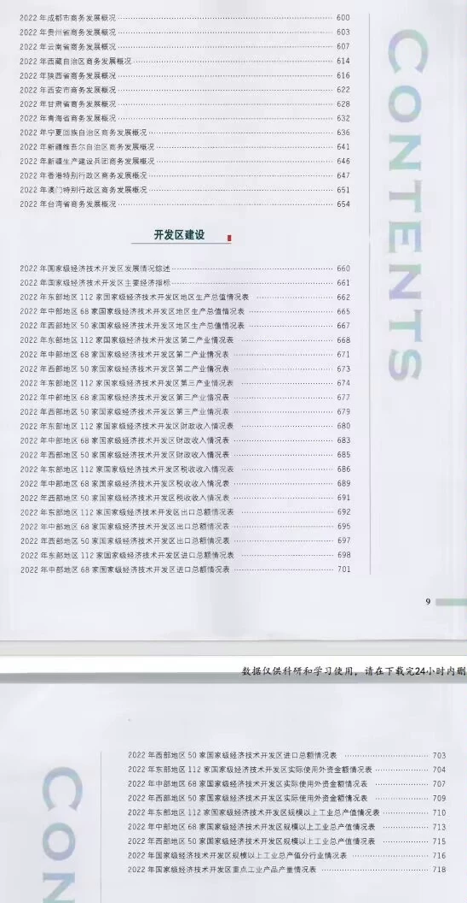

## Body

China Business Yearbook Data (2004-2024)

Year of the Yearbook: The year of the business yearbook is from 2004 to 2024 (the data year needs to be subtracted by one).

01. Data Introduction
The China Business Yearbook includes data from the 2003 fiscal year, covering domestic trade, service trade, foreign investment, and foreign economic cooperation in China. It provides basic data support for researching differences in China's foreign trade, regional economic disparities, etc., and hopes to provide useful references for all sectors of society studying business work. In 2024, only the Excel format is available.

02. Detailed Indicators
The directory is displayed in the picture, please view it on your own, purchase as needed, and do not help me find data. All indicators are here, and there is no return without reason.
The display directory is for 2023, with a lot of content. For some parts, you can use search engines to understand the content beforehand. The statistical methods may change from year to year, and academic knowledge, please note.

03. Data Content
The data is in both Excel and PDF formats. In 2024, only the Excel format is available, and there is no PDF in 2023. They are placed in a zip file named "China Business Yearbook (2004-2024)". The file settings have been screenshoted and shown, please check them before purchasing.

## Images

item_1074036424809

Here is a pay link on Stripe ( https://buy.stripe.com/3cs8yP7sY87d0vu9AB ). Please contact me lonlonago@foxmail.com after funding $89, and I will send you a complete data files , thank you!

